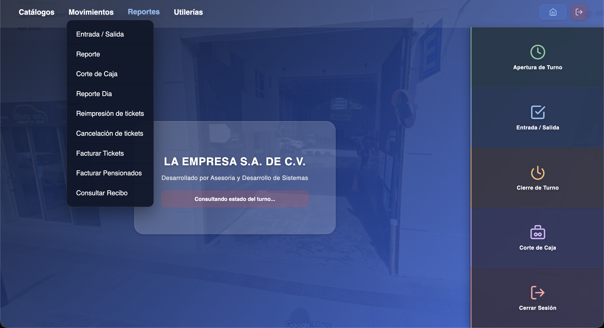

# Sistema de Estacionamientos

Documentacion inicial del proyecto completo (backend + frontend + base de datos + pagos).

## Estructura general

- `backend/Estacionamientos-backend`: API FastAPI, logica de negocio, sincronizacion y pagos.
- `frontend/estacionamiento-frontend`: Aplicacion Angular (PWA) para operacion del estacionamiento.
- `bd`: respaldos y scripts SQL para crear/actualizar estructura de base de datos.
- `docs`: documentacion tecnica inicial de instalacion y despliegue.

## Inicio rapido

1. Revisar prerequisitos en `docs/requisitos.md`.
2. Configurar base de datos en `docs/base-de-datos.md`.
3. Configurar backend en `docs/despliegue-backend.md`.
4. Configurar frontend Linux + Apache en `docs/despliegue-frontend-linux.md`.
5. Si usas pagos en linea, revisar `docs/deployment-webhooks.md`.

## Navegacion de documentacion

Indice completo en `docs/README.md`.
